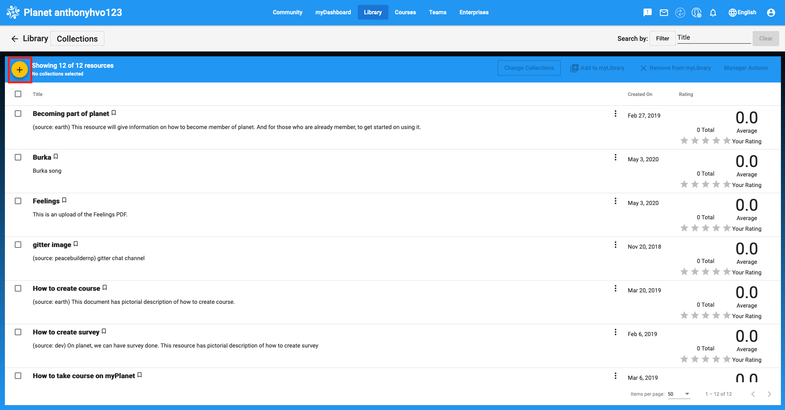
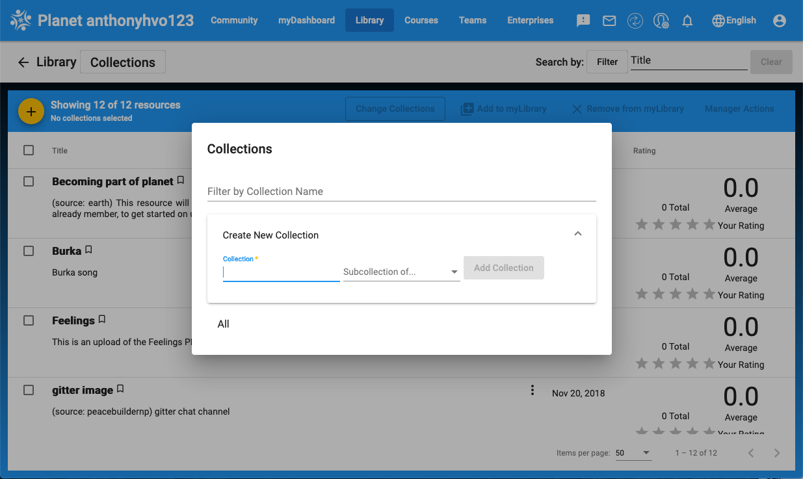
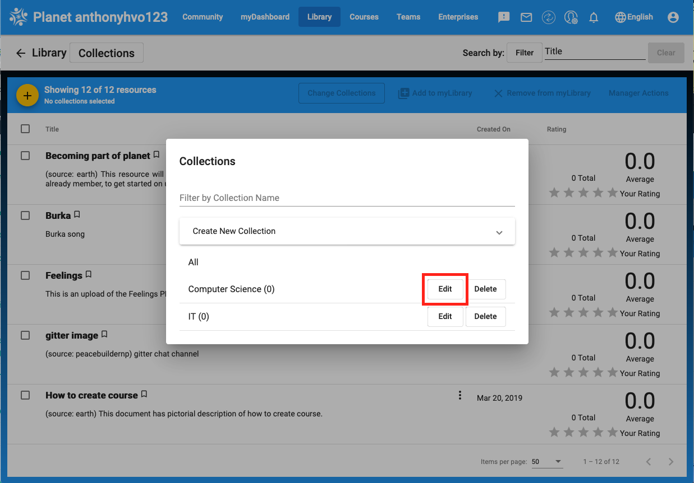

# Library and Resources Overview

## What is the Library?

The library it the place where learning resources are stored and categorized within the Planet system. Resources are listed alphabetically, which allows Learners to select the first letter of their resource or the page number they wish to view. Additionally, library resources can be organized into collections, which allows Learners to quickly find resources that are categorized by subject, grade level, or any attributes assigned. Resources and collections are explained in detail below.

## How are the Community and National Library Different?

The community library is a subset of the national library. The community library administrator can add resources locally and then push resources to the national library. Alternatively, resources can also be pushed from the national library to the community library.

Note: If the same resources is up added in two different places then it will appear in the library in duplicate. 

## What is the preferred means of populating the library?

Although resources can be added at either the community or national level, it is recommended that the nation be used as the primary means of organizing and sharing resources. We do recognize that this is not always possible due to connectivity issues. If you are using the community server as the primary means of populating the library careful management is needed to avoid resource duplication errors. 

## What is a Resource?

A Planet resource is any material that has been uploaded into the digital library. There are many types of resources. PLANET can accommodate PDFs (books), MP3s (audio), MP4s (videos), HTML5 applications (interactive content), and just about any other format. Resources can be viewed in the library . The make of the library can vary from Communities to Community and from Nation to Nation. Resources may also be stored in a variety of languages, including (but not limited to) English, Kiswahili, French, Spanish, Arabic, and Somali.

## What is a Collection?

A collection is a group of resources that are grouped by attribute such as topic/subject, grade level, intended use, etc. PLANET currently follows the Library of Congress categorization system. Collections exist as the main category. Within a collection resources can be further grouped into sub-collections to further define and categorize the collection. Collections are alphabetized by topic.

# Library Navigation

## How do I upload a Resource?

1. Log in as a **Learner**, **Leader**, or **Manager**.

2. From the **_Community_** page click on the **_Library_** heading.

3. After clicking on the **_Library_** heading, click on the add button (red box) as follows: 

You should be taken to the following screen:

1. The **Title** of the Resource goes here. Capitalize all principal words and make sure everything is spelled correctly. If there are any dashes in the title, leave a space on either side (i.e., “Addition - Subtraction” NOT “Addition-Subtraction”). Do not start the title with numbers or special characters (!@#$%^&*). If the title is already taken (for example, a version in another language has already been uploaded) include the language of the new Resource in parentheses. Examples are shown below.

          a. A Tale of Two Cities
          b. A Tale of Two Cities (Spanish)

2. Type the name of **_Author(s)/Editor_**. Authors should be listed as follows: “FIRST NAME, LAST NAME.” Illustrators, editors, translators, etc., should be identified in this section with their title in parentheses.

          a. John Doe
          b. Jane Doe (Translator)

3. If available, type the **_Year_** in which the Resource was published.  

4. Add a **_description_** for the resource in the text area if applicable.  

5. You may choose a **_Collection_** in which to place your Resource. Collections are more narrow than subjects in their scope. In many cases, you may find a Collection name that already exists and best fits your Resource. Use the search bar at the top of the drop down list to search for relevant Collections. If the Resource fits into more than one Collection, choose more than one. The “Add New” button next to Collection should be used only if a relevant existing Collection cannot be found. In most cases, Learners will not need to add new Collections.  

6. In the **_Language field_**, choose the language of the Resource. If the Resource is a multilingual document, choose the language that you think is the primary or most applicable language.

7. **_Publisher/Attribution_** is for copyright purposes. Type the name of the organization or publisher (and any websites associated with the Resource, if applicable). Attribution allows OLE to use the source under Creative Commons or copyright and protects us from violating copyright laws.  

8. **_Link to License_** is also for copyright purposes. Locate the copyright information for the Resource. If it has a Creative Commons license, locate the correct license from the Creative Commons website and paste the URL in the Link to License field. Type “Public Domain” if the Resource is in the public domain.  

9. Choose one **_Subject_** from the drop down list that your Resource fits into. Subjects are broad and general so you may not find an exact match.  

10. Select at least one **_Level_** from the drop down list to assign to your Resource. Levels refer to the reading level required to be able to understand this Resource. You may choose multiple levels, but please ensure they actually apply to the reading level of the Resource.  

11. The **_Open_** field relates to the medium of the Resource. Examples are shown below.

          a. A resource with a .PDF extension has PDF format.
          b. A .mp3 is Audio (MP3) format.
          c. A .mp4 or .flv is Video (MP4, FLV) format. NOTE: If the video does not play when MP4 is selected then try changing this field to FLV and playing the video.

12. In the **_Resource For_** field choose Learner or Leader. If appropriate for both, choose Learner.  

13. Choose the **_Media_** for your Resource: Text, Graphic/Pictures, Audio/Music/Book, or Video. If you are unsure, leave this tab on the default Text.  

14. Choose the **_Resource Type_** to select which kind of Resource you are uploading: Textbook, Lesson Plan, Activities, Exercises, or Discussion Questions. If your Resource does not seem to fit any of these categories, leave this tab on the default Textbook setting.  

15. Select the **_Browse_** button and locate your file. When you have found it, select Open. Double check all the fields to ensure they are correct and then select Save.  

16. Check the **_File downloadable_** if you want to make the file downloadable.

You will be taken to a loading screen while your Resource is uploaded into the Library. When the upload is complete, you will receive a confirmation for a successful upload.

**IMPORTANT:** Once you have finished uploading your resource **locate the resource in the Library and confirm that it was uploaded correctly and can be viewed/heard.**

We have various types of resources that either form a collection or belong to common groups of resources. These include the African Storybooks, Comic Books, CK-12 Textbooks, TED-Ed videos, Khan Academy Videos, etc. If you are uploading one of these resources, please read the specific guides we have created and follow the instructions. This maintains uniformity in resource details and makes searches easier for Learners.

You may need to use a format converter to put your resource in the correct format before uploading. There are numerous free online converters which you may use.

Important: Until all Nations can communicate with each other and resources can easily be shared between Nations, resources that are appropriate for uploading to more than one Nation (i.e. Somaliabell, and Kenyabell) must be uploaded into each Nation using the same cataloging information each time. This can be a time-consuming process, but it is currently the only way we can ensure that resources are available in each Nation.

## How do I name a file so that it can be uploaded?

The following file naming conventions should be used for any new file uploaded to PLANET:

* Rename the file with a meaningful and unique file name that can be easily associated with the title/content of the resource. For example: Alcott_LittleWomen.pdf
* Use alpha-numeric characters only. Do not use special characters (except for "-" and "_").
* Do not include spaces in the file name. Instead of a space, use an underscore.
* Do not use characters or letters that do not exist in the English language. For example, avoid naming your files in Arabic without transliteration.
* If there is a series of resources, the first part of the file name should be consistent (e.g., module title), followed by the number in the series, followed by the title of the specific file (e.g., ComputerBasics01_GettingToKnowComputers.pdf, ComputerBasics02_UnderstandingOperationSystems.pdf, etc.).
* Use leading zeros (i.e., 01, 02, etc. or 001, 002, etc.) for documents that are part of a series so that they are sorted numerically.

## Are there resources that have specific rules for uploading?

Yes. These resources are covered in an additional manual titled, XXXXX. Please read that manual to address specific questions on uploading in other languages, in additional formats, or in existing collections with special permission.

## How do I create and use collections?

Collections can be used by Nation administrators and managers to categorize materials by topic. Collections make it easy to group resources so that they are easily found by Learners. **NOTE:** Collections cannot be transferred between Nations and Communities so any changes to a collection are unique to that specific instance of PLANET. Collections can only be created or changed by administrators.

1. Log in to the Manager account.
2. Click “Library” on the top navigation bar and then “Collections”.

3. You can either manage existing collections or create a new collection. We will first create a new collection. Click on “Add Collection.”

4. You will then be prompted to fill out the below form. Type the name and description of the collection. “Nested Under” refers to whether this will be a top level collection or a sub-collection. Sub-collections are nested under other collections. If you wish to create a collection rather than a sub-Collection, please leave this category set to the “--Select--” option.

5. Once complete click “Save” to create the new collection.

6. To edit a collection, go back to the main collection page and click on the button next to the collection you want to edit.

7. You will be directed to the same screen as the creation page. Change any of the information which should be updated and click “Save.” You can also delete or nest (sub-categorize) the collection.
