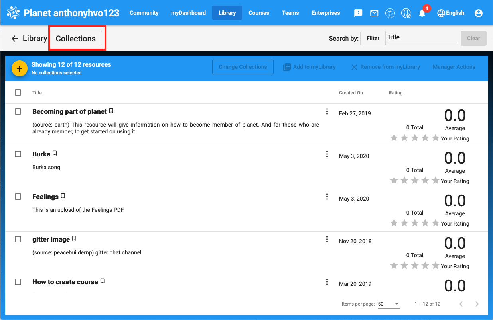
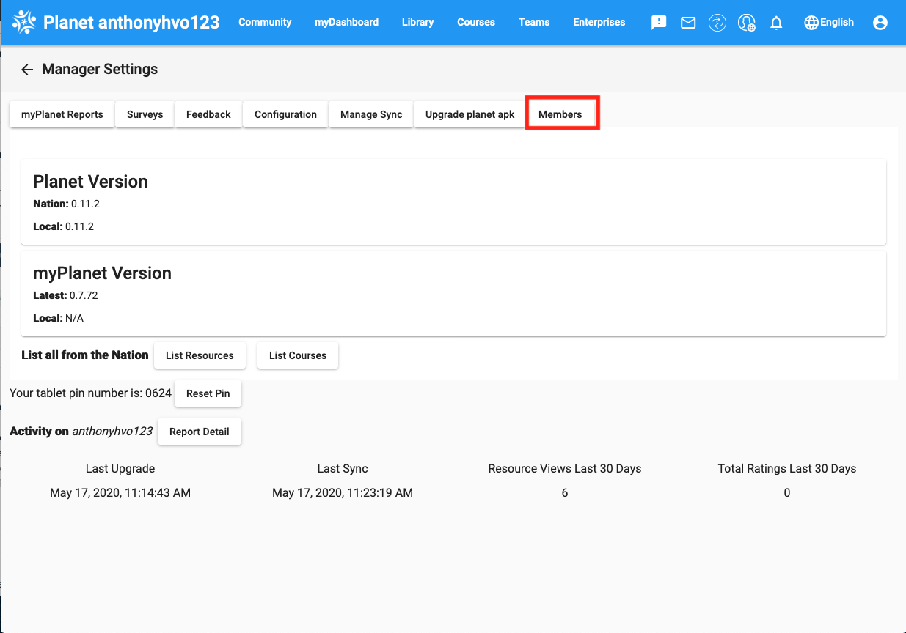
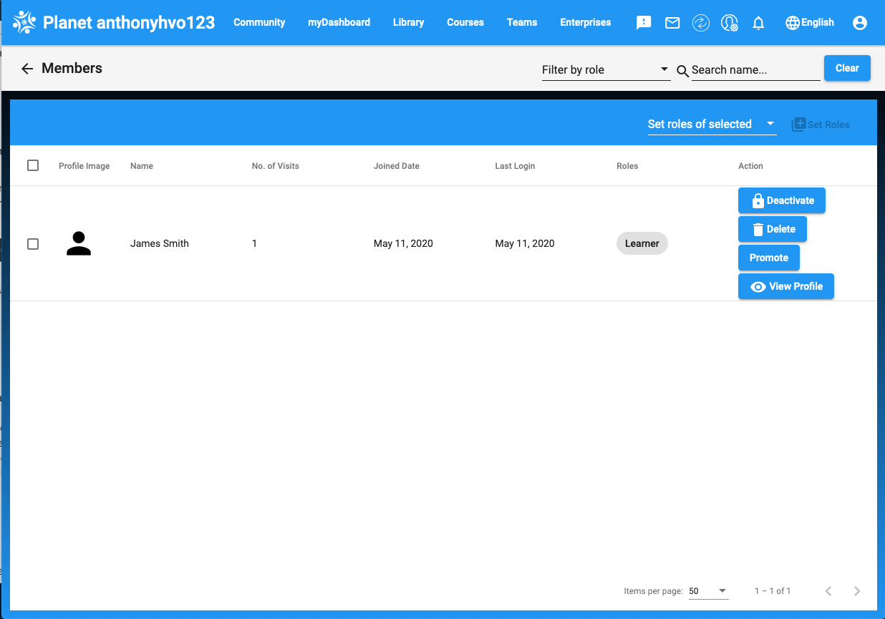
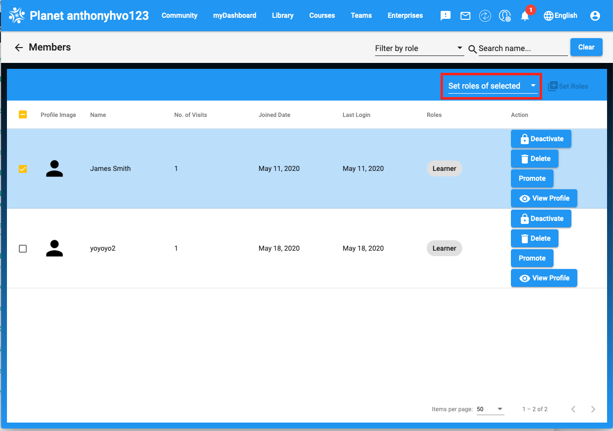
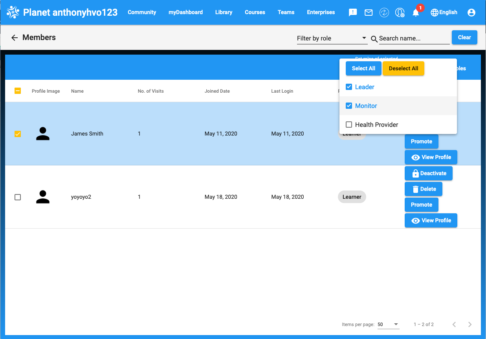
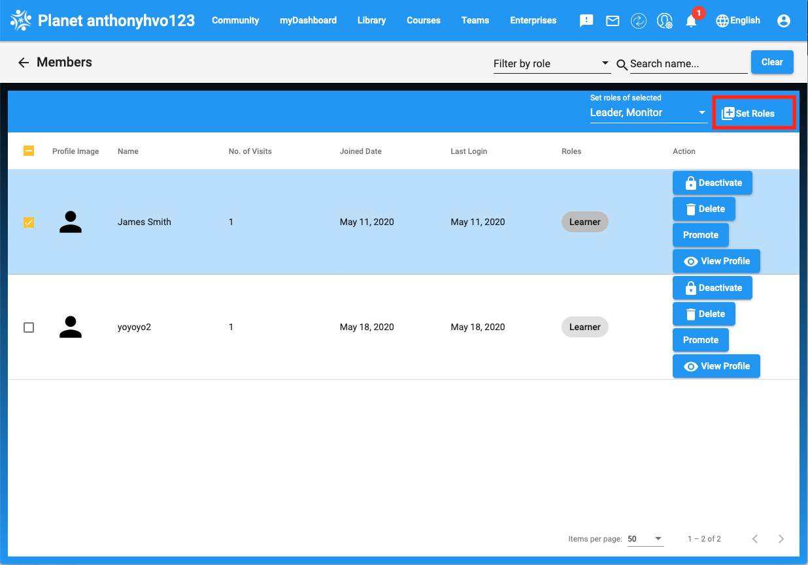

# Open Learning Exchange

# OLE

The [**Open Learning Exchange (OLE)**](http://ole.org) is committed to ensuring that everyone, especially children, has access to a high quality basic education. We work with nation-based entrepreneurs, educators, and practitioners committed to promoting highly effective and affordable learning systems that can benefit all of their people. We believe this will lead to more productive lives, communities, and nations, and to the possibility of a peaceful world.

OLE’s mission is to ensure learning for all, not only universal basic literacy and numeracy, but also vital knowledge and skills acquisition in the areas of health, nutrition, community development. Since 2007, OLE International has helped establish Open Learning Communities for children, adolescents, and young adults, including those whose lives have been disrupted by violent conflicts.  Today there are OLE affiliates in Asia, Africa, the Middle East, and Latin America.

## The Planet Learning System

### _What is the OLE Planet Learning System (Planet)?_

Personalized Learning And Networked Enabled Teams (Planet) is a multilingual learning system and library with thousands of educational Resources including books, videos, and educational games. The system also includes software tools for content and student management, student evaluation and monitoring, and Courses creation.

At the core, Planet is a repository of free, open access, and public domain Resources designed to benefit literate and preliterate, young and old, and novice and expert learners of all ages. Resources of all kinds (literature, health, science, math, etc.), in various languages (English, Somali, Swahili, Arabic, Spanish, etc.), and in various formats (text, audio, video) are continually being added to Planet.

The Planet system exists in the cloud but it can also be configured to run locally without the need for internet connectivity making it a viable solution for remote locations where internet connectivity is unreliable or nonexistent. Planet facilitates frequent assessments of learners, leaders, and administrators. It also promotes the evaluation and effectiveness of the learning Resources. Robust usage feedback metrics make Planet a powerful tool for those overseeing monitoring and evaluation of the education system.

### _What are Planet Nations and Communities?_

Under the Planet system, there are two types of structures: **Nations** and **Communities**.

* **Nations**
  * **Nations** always exist in the cloud and require an internet connection to access;
  * Each **Nation** serves as a central repository for the **Community** or **a** group of communities that it serves; and
  * Different **Nations** cannot connect to each other.

* **Communities**
  * A **Community** is a local installation of the Planet system;
  * A **Community** does not require an internet to access;
  * Users connect to a **Community** via a router through a locally configured _intranet_ using either a device with a web browser (tablet, computer, etc.);
  * Each **Community** connects periodically to a **Nation** via _internet_ in order to receive new materials and to upload user metrics; and
  * A **Community** is not able to connect to other **Communities**.

The **nations** may store thousands of Resources in many formats and languages. Unique collections of Resources can be selected and downloaded into each **Community** from the **Nation**. This gives a Learner a personalized approach to his or her education.

## How do I Navigate and Use Planet?

### _How do I access Planet and become a member?_

1. To create an account use a web browser to navigate to your Nation or Community and click on “_Become a Member_” to get started.

2. Fill out the resulting form and completing the form, click “_Register_.” You are now a member!

Note: Each Planet system is unique; universal memberships do not exist. If you become a member of a specific Nation or Community, you do not automatically become a member of any other existing Nations and Community. To become a member of another Nation or Community you must register with a new account.

### _What are the differences between Learners, Leaders, and Managers?_

In the Planet system, there are three different kinds of users: **Learners**, **Leaders**, and **Managers**.

**Learner** is the default user level when a person first joins. Each person continues to be a Learner regardless of additional responsibilities and roles. All Learners have access to standard and individualized user functionality.

**Leaders** are Learners that have created a Course or have become _Course Leaders_. Leaders have access to all Learner functionality and to additional Course management functionality.

**Managers** have access to Learner, Leader, and additional functionality that allow them to manage local Resources, publications, collections, surveys, data sync schedules, and local software updates.

If you are currently using this manual, then you are most likely a manager who is organizing and overseeing a Community or a Nation and its Communities. In order to see the available manager functionality, click on “_Manager_” next to your name on the Dashboard (see below, _How do I navigate the Dashboard_). Managers can also add, hide, delete, and view the details of Resources as well they can create, edit, re-categorize, and delete collections.

### _How do I navigate the Dashboard?_

An example of the Manager Dashboard is shown below. The functionality is defined for each element of the Dashboard.

1. **Home** directs the Learner to the main Dashboard page and provides easy access to most Planet functionality.

2. **Library** allows a Learner to browse the digital Resources. It also allows a Learner to view collections of Resources by topic or to view the Resources alphabetically. 

3. **Courses** gives Learners the option to view each Course and to request admission.

4. **Teams** give a list of teams the user is on.

5. **Enterprises** allows for basic meetings. Meeting invites are sent to the calendars of other Planet Learners.

6. **Surveys** allows Nation Managers to push a survey Planet users based on characteristics like age, gender, member type, Community, etc.

7. **Feedback** allows Learners to give feedback for the Resource or page they are viewing.

8. **Email** is a basic email system which allows Learners to receive and set notifications and send and receive messages

9. **Sync** allows user to update to the current Planet system.

10. **Manager Settings** allows Managers to change settings such as configuration, manager sync, upgrade and reports.

11. **Notifications** allows user to see any notification for changes.

12. **Language** shows the language of the user interface and allows the user to switch between languages.

13. **Menu** options for viewing profile, editing profile, changing password and to logout of the system.

14. **Type of Member** shows the access level of user - Learner, Leader, or Manager. This also allows Managers to oversee Nation maintenance.

15. **myLibrary** displays the Resources that were added to “_My Library_” by the Learner.

16. **myCourses** Progress displays Courses in which the Leader/Learner is enrolled and the progress of each Course.

17. **myTeams** displays the current teams the learner is apart of.

18. **mySubmissions** is the user's course submissions.

19. **myAchievements** is the user's current achievements.

20. **ourNews** location where news can be shared.

21. **mySurveys** allows Nation Managers to push a survey Planet users based on characteristics like age, gender, member type, Community, etc.

**_You might notice a slight difference if you have a smaller screen size. Items 1-6 move to the side, as do 7 and 9. There is also an additional logout button._**

# Library and Resources Overview

## What is the Library?

The library is where learning Resources are stored and categorized within the Planet system. Resources are alphabetized which allows Learners to select the first letter of their Resource or the page number they wish to view. Additionally, library Resources can be organized into collections which allow Learners to categorize and group Resources by subject or other attributes. Both Resources and collections are explained in further depth below.

## What is a Resource?

A Planet Resource is material that has been uploaded into the digital library.  There are many types of Resources, not just books.  Planet can accommodate PDFs (books), MP3s (audio), MP4s (videos), HTML5 applications  (interactive content), and just about any other format.  Resources can be viewed in the library and may vary from Nations to Communities.  Resources may also be stored in a variety of languages, including (but not limited to) English, Kiswahili, French, Spanish, Arabic, and Somali.

## What is a Collection?

A collection is a group of Resources based on topic/subject and intended use. Planet currently follows the Library of Congress categorization system. Collections exist as the main category. Sub-collections allow Nation Managers to group Resources more specifically within a collection. Collections are alphabetized by topic.

# How do I navigate and use the Library?

## How do I upload a Resource?

1. Log in as a **Learner**, **Leader**, or **Manager**.

2. Start on the main **_Dashboard_** and click on the **_Library_** heading.

3. After clicking on the Library heading, choose **_“Add New Resource.”_** You should be taken to the following empty screen:

1. The **Title** of the Resource goes here. Capitalize all principal words and make sure everything is spelled correctly. If there are any dashes in the title, leave a space on either side (i.e., “Addition - Subtraction” NOT “Addition-Subtraction”). Do not start the title with numbers or special characters (!@#$%^&*). If the title is already taken (for example, a version in another language has already been uploaded) include the language of the new Resource in parentheses. Examples are shown below.

          a. A Tale of Two Cities
          b. A Tale of Two Cities (Spanish)

2. Type the name of **_Author(s)/Editor_**. Authors should be listed as follows: “FIRST NAME, LAST NAME.” Illustrators, editors, translators, etc., should be identified in this section with their title in parentheses.

          a. John Doe
          b. Jane Doe (Translator)

3. If available, type the **_Year_** in which the Resource was published.  

4. Add a **_description_** for the resource in the text area if applicable.  

5. You may choose a **_Collection_** in which to place your Resource. Collections are more narrow than subjects in their scope. In many cases, you may find a Collection name that already exists and best fits your Resource. Use the search bar at the top of the drop down list to search for relevant Collections. If the Resource fits into more than one Collection, choose more than one. The “Add New” button next to Collection should be used only if a relevant existing Collection cannot be found. In most cases, Learners will not need to add new Collections.  

6. In the **_Language field_**, choose the language of the Resource. If the Resource is a multilingual document, choose the language that you think is the primary or most applicable language.

7. **_Publisher/Attribution_** is for copyright purposes. Type the name of the organization or publisher (and any websites associated with the Resource, if applicable). Attribution allows OLE to use the source under Creative Commons or copyright and protects us from violating copyright laws.  

8. **_Link to License_** is also for copyright purposes. Locate the copyright information for the Resource. If it has a Creative Commons license, locate the correct license from the Creative Commons website and paste the URL in the Link to License field. Type “Public Domain” if the Resource is in the public domain.  

9. Choose one **_Subject_** from the drop down list that your Resource fits into. Subjects are broad and general so you may not find an exact match.  

10. Select at least one **_Level_** from the drop down list to assign to your Resource. Levels refer to the reading level required to be able to understand this Resource. You may choose multiple levels, but please ensure they actually apply to the reading level of the Resource.  

11. The **_Open_** field relates to the medium of the Resource. Examples are shown below.

          a. A Resource with a .PDF extension has PDF format.
          b. A .mp3 is Audio (MP3) format.
          c. A .mp4 or .flv is Video (MP4, FLV) format. NOTE: If the video does not play when MP4 is selected then try changing this field to FLV and playing the video.

12. In the **_Resource For_** field choose Learner or Leader. If appropriate for both, choose Learner.  

13. Choose the **_Media_** for your Resource: Text, Graphic/Pictures, Audio/Music/Book, or Video. If you are unsure, leave this tab on the default Text.  

14. Choose the **_Resource Type_** to select which kind of Resource you are uploading: Textbook, Lesson Plan, Activities, Exercises, or Discussion Questions. If your Resource does not seem to fit any of these categories, leave this tab on the default Textbook setting.  

15. Select the **_Browse_** button and locate your file. When you have found it, select Open. Double check all the fields to ensure they are correct and then select Save.  

16. Check the **_File downloadable_** if you want to make the file downloadable.

You will be taken to a loading screen while your Resource is uploaded into the Library. When the upload is complete, you will receive a confirmation for a successful upload.

Note: Once you have finished uploading your Resource, **locate the Resource in the Library and confirm that it was uploaded correctly and can be viewed/heard.**

We have various types of Resources that either form a Collection or belong to common groups of Resources. These include the African Storybooks, Comic Books, CK-12 Textbooks, TED-Ed videos, Khan Academy Videos, etc. If you are uploading one of these Resources, please read the specific guides we have created and follow the instructions. This maintains uniformity in Resource details and makes searches easier for Learners.

You may need to use a format converter to put your Resource in the correct format before uploading. There are numerous free online converters which you may use.

Note: Until all Nations can communicate with each other and Resources can easily be shared between Nations, Resources that are appropriate for uploading to more than one Nation (i.e. Somaliabell, and Kenyabell) must be uploaded into each Nation using the same cataloging information each time. This can be a time consuming process, but it is currently the only way we can ensure that Resources are available in each Nation.

## How do I name a file so that it can be uploaded?

The following file naming conventions should be used for any new file to upload to Planet:

* Rename the file with a meaningful and unique file name that can be easily associated with the title/content of the Resource. For example: Alcott_LittleWomen.pdf
* Use alpha-numeric characters only. Do not use special characters (except for "-" and "_").
* Do not include spaces in the file name. Instead of a space, use an underscore.
* Do not use characters or letters that do not exist in the English language. For example, avoid naming your files in Arabic without transliteration.
* If there is a series of Resources, the first part of the file name should be consistent (e.g., module title), followed by the number in the series, followed by the title of the specific file (e.g., ComputerBasics01_GettingToKnowComputers.pdf, ComputerBasics02_UnderstandingOperationSystems.pdf, etc.).
* Use leading zeros (i.e., 01, 02, etc. or 001, 002, etc.) for documents that are part of a series so that they are sorted numerically.

## Are there Resources that have specific rules for uploading?

Yes. These Resources are covered in an additional manual titled, XXXXX. Please read that manual to address specific questions on uploading in other languages, in additional formats, or in existing Collections with special permission.

## How do I create and use Collections?

Collections can be used by Nation Managers to categorize materials by topic for their Learners. Collections are helpful tools for Learners who wish to easily find and sort Resources in the Library. **NOTE:** Collections cannot be transferred between Nations and Communities so any changes to a Collection are unique to that specific instance of Planet. Collections can only be created or changed by Managers.

1. Log in to the Manager account.
2. Click “Library” on the top navigation bar and then “Collections”.

3. You can either manage existing Collections or create a new Collection. We will first create a new Collection. Click on “Add Collection.”

4. You will then be prompted to fill in the form shown below. Type the Collection name and description. “Nested Under” refers to whether this will be a top level Collection or a sub-Collection. Sub-Collections are nested under other Collections. If you wish to create a Collection rather than a sub-Collection, please leave this category set to the “--Select--” option.

5. When the form is complete, click “Save” to create the new Collection.

6. To edit a Collection, go back to the main Collection page and click on the button next to the Collection you want to edit.

7. You will be directed to the same screen as the creation page. Change any of the information which should be updated and click “Save.” You can also delete or nest (sub-categorize) the Collection.

## Courses Overview

### _What is a Course?_

A Course allows Leaders to walk Learners through specific Resources and exercises to learn new skills. Leaders can create Courses by grouping and ordering Resources and allowing Learners to upload papers or take Quizzes.  

### _How do I create a Course?_

To create a Course, log in and start from the Home page.
- Go to the *“Courses”* tab in the top menu and then select *“Add Course.”*

Fill out the following form:

1. **Course Title.** The name or title of the Course.

2. **Language of Instruction.** The language of Course materials. Please use the name of the language in that language. For example, العربية .

3. **Member Limit.** The number of Learners that are allowed to enter the Course.

4. **Course Leader.** Choose a single Leader or multiple Leaders to manage the Course

5. **Description.** Provide a course description.

6. **Method.** Describe the way you envision the Course being used (e.g., school Course, enrichment Course, training manual, independent learning, special programs, etc.)

7. **Grade Level.** Suggested grade level of the Learners

8. **Subject Level.** Subject level - beginner, intermediate, or advanced.

9. **Start Date.** Start date of the Course (only if applicable)

10. **End Date.** End date of the Course (only if applicable)

11. **Frequency.** Frequency of Course meeting, either Daily or Weekly (only if applicable)

12.	**Start Time.** Start time of the Course (only if applicable)

13.	**End Time.** End time of the Course (only if applicable)

14.	**Location.** Physical location of Course (only if applicable)

15.	**Foreground/Background Color.** Colors shown to Learners on their Dashboard when they join the Course

- Scroll down to the bottom of the screen and select *“Add Step”* to create the first lesson of the Course.

1. **Title:** Name of the Step

2. **Step Method.** Describe the way you envision the Step being used

3. **Description.** Describe the Step and the material that will be covered

4. **Step Goals.** List the goals of accomplishing and completing the Step

5. **Outcomes.** Please select either Paper, Quiz, or both Paper and Quiz (by selecting both) to complete the Step

6. **Passing Percentage.** Select the percentage required on the Paper or Quiz to pass the Step

- By selecting *“View Details”* of a specific Course, you can then see the screen below and modify the Course. Select *“Add Resource”* to search through the Library for Resources to include in the Step. You can also create a Quiz from this section by selecting *“Create Quiz."*

- In order to add a Resource, click the *“Add Resource”* button. The Resources must exist within Planet before they can be included in a Course.  

- Follow the instructions below to add Resources to your Course.

1. Perform a keyword search to search for specific Resources. To refine/broaden your search, filter by subject, Collections, level, medium, or rating.

2. Check individual or all Resources that come up in the search results.

3. Click *“Add to Level”* to add the Resource to the Step.
**NOTE:** If you go to the next page without adding each Resource, your selections will be erased, so you should add the currently selected Resources before moving on to the next page.

4. In the Step Management panel, click *“View”* to make sure that your Resource is opening properly. To delete a Resource from the Step, click *“Remove.”*.

- To create a Quiz, click *“View Details.”* Click *“Create Quiz”* button located on the bottom right corner.

1. You can create as many or as few questions as you want for each Quiz. However, you must give 5 choices (Options A, B, C, D, and E) for each question. You can make True or False questions by making Option A = True, Option B = False, and inserting a “-” to fill the other answer choices. Select *“Add Question”* in order to add the question to your Quiz.
**NOTE:** If you do not select *“Add Question,”* the Quiz question will not be automatically added.

2. Once your Quiz is complete, click *“Save Quiz.”*

3. Make sure that the *“Quiz”* box is always checked in the original New Step panel, otherwise the Quiz may not show up.

4. You can always return to the Quiz to add questions.
**NOTE:** Once you select *“Next Question,”* you cannot go back or save the Quiz until you have filled it out.

### _General Guidelines for Steps and Courses_

Below is a list of general guidelines for Steps and Courses.

* Aim to have between 6-10 Steps for each Course, although this will vary depending on the nature of the Course, i.e., if it is for school, general knowledge, professional development, etc. There are examples of Courses of 40-50 Steps which is applicable and needed in those cases. However, Courses should have a minimum of at least five Steps.

* The number of Resources per Course can also vary. However, they should be comprehensive enough to provide thorough knowledge on the subject, offer a variety of “real-world” examples and/or case studies, include some possible activities or thought-provoking discussion questions, and make a smooth transition to the next Step. Try to include a mix of media as well, i.e. videos, audio, photographs.

* As an alternative to creating a Quiz, you can also assign a paper for Learners to upload. Just type the paper assignment in the instruction box for Learners to view.

- If you change your mind and want to create a Quiz instead of a paper or vice versa, you can switch by going to the *“Edit Step”* tab.

### _Managing a Course_

Below are tips for managing a Course.

* You can always make changes to the Course by going to the “Courses” tab and clicking on “Manage.”

- To see what your Learners see, click on *“View Course.”* You can also go to *“My Home”* and access the Course in the *“My Courses”* bar to view the Course as a Learner.

- You can invite a specific Learner to join the Course or a whole grade level by clicking on *“Invite Members.”*

- If a Learner has requested to join a Course you will receive an email in your inbox (located at the bottom menu on the *“My Home”* page) asking you to accept.

- To track your Learners’ completion and score on Quizzes, go to *“Progress.”*

## Members Menu

### _What is Members Menu?_

**Members** menu is a place to see, search, modify, and delete (for admin) an entire member of a community/nation where we logged in.

A user is able to see and search for members within the community/nation, but can't modify other members data.
An administrator of a community/nation is able to modify or delete members data if necessary.

### _How do I access the Members Menu?_

1. Click on the "Manager Settings" button (red box) from the Community page.

   

2. Click on the "Members" tab (red box) from the Manager Settings page.

   

3. You should see the Members page below.

   

Notes:

1. **Deactivate** - use this button to deactivate a member.

2. **Delete** - use this button to delete members from your community.

3. **Promote** - use this button to promote a member to the role of a community admin.

4. **View Profile** - use this button to view and edit the profile of a member.

5. We can filter members by their roles with the "Filter by role" drop down menu or search members by name with the "Search name..." search bar.

6. We can also set special roles for members. To do so, first check the boxes next to the profile images of the members to set roles for. Then click the drop down menu "Set roles of selected" (red box).

   

   Choose the roles you want to set for the members selected. You can also choose "Select All" or "Deselect All."

   

   Click on "Set Roles" (red box) to finish setting the roles.
   

## Reports Overview

### _What is a Report?_

Reports allows distribution of Nation Reports as needed by Nation Managers. Managers can add new Reports, check the activity on each Report, and look at trends for each Report.

### _How do I create a Report?_

Click on _“Reports”_ on the Dashboard main menu as shown below.

Planet has three different kinds of Reports:  

   **A.** Add a New Report   
   **B.** Activity Report  
   **C.** Trend Activity Report

#### **Option A:**  

Click on *“Add a New Report”* to add a new Report. Fill in the information for the new Report and add any relevant Resources. Then click *“Save.”*

#### **Option B:**  

In the Reports page, the Manager can also select *“Activity Report.”*

*“Activity Report”* allows the Manager to check any changes that happen between two specific dates. First, select the start and end dates. Then click *“Generate Report.”*

After Clicking on *“Generate Report”* the Manager will be able to view Registered Members, the Activity Report, visits by gender, most frequently opened Resources, highest rated Resource, and lowest rated Resource.

#### **Option C:**

In the Reports page, click *“Trend Activity Report.”*

Then click *“Generate Report.”*

In resulting Report the Manager will be able to see a visual graphic representing activity over the past 12 months as shown below.

## Feedback Overview

### _What is Feedback?_

Feedback allows Learners to provide feedback on the currently open page. Feedback helps OLE make improvements to the software over time.

### _How do I provide Feedback?_

Learners can give feedback for any page or Resource at any time by clicking on “Feedback” and filling out the information in the form shown below. When finished, click “Submit” to send feedback to OLE.

## Language Overview

### _How do I change the Language?_

Learners can change the language of the Planet system at any time by selecting the language pull down menu from in the top right corner.

## Software Overview

### _How do I receive a software update for my Community?_

In order to update software and receive Publications,

1. You must connect your router to the internet via Ethernet cable and log in as a Manager. Most likely, your Manager account will be the following: 

       a. Login: Admin User Name
       b. Password: Admin Password
        
1. Checking your software by selecting the manager setting from the top right corner.
  
   
   
1. As shown below, showing software of Nation Version and Local Version. You will only get update if both versions do not match.
  
   
   
1. Upgrading software is done by selecting **Upgrade**.
  
   
    
1. **Upgrade planet apk** will allow to get latest myplanet.
  
    

1. There is verify button shown once update is done successfully. So you can verify if upgrade was successful or had some error.

